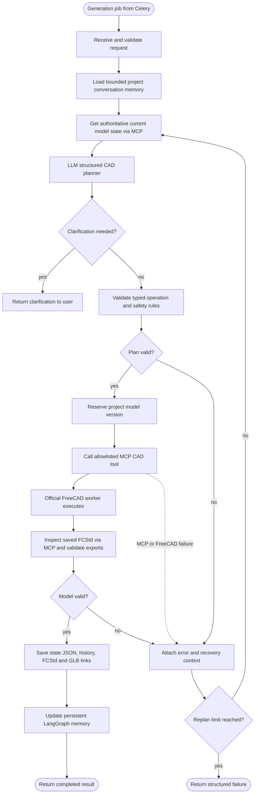

# CadPilot architecture

```text
CadStudio (one React page)
        │ HTTP + polling
FastAPI ─┴─ PostgreSQL (projects, jobs, version gate)
        │ enqueue `cad_tasks`
Redis ── Celery worker (one process/container)
        │ LangGraph: receive → memory → state → plan → validate
        │                 ↑ validation error / refreshed state
        │ MCP stdio client (allowlisted tools only)
FreeCAD MCP → execute_code_headless → official FreeCAD `freecadcmd`
        │
Versioned storage: FCStd + STL + GLB + state JSON + history
```

The worker is the sole owner of FreeCAD computation. The API never imports FreeCAD or waits for model generation. Each worker uses `--concurrency=1`; scale by adding worker containers, not by increasing FreeCAD process concurrency.

## LangGraph CAD workflow

The Celery task invokes the complete graph below inside the isolated FreeCAD worker. This is intentionally richer than a linear “plan then execute” chain: both plan failures and post-execution model-validation failures return through a recovery loop that refreshes FreeCAD's authoritative state before replanning. Recovery has a bounded attempt count and never repeats an already attempted operation.



The planner is a typed `CADPlanner` interface. When `OPENAI_API_KEY` is configured, the worker uses the Responses API with strict JSON Schema output for `PlanResult`; without a key it uses a deterministic bootstrap planner so local development remains offline. Either path enters the same Pydantic validation and recovery loop. The schema advertises only operations that the worker can execute—currently `create_box`; unsupported requests produce clarification rather than executable code. The MCP compiler still converts only validated operations into fixed FreeCAD script templates.

## FreeCAD MCP integration

The worker builds the CAD engine from the official [FreeCAD source repository](https://github.com/FreeCAD/FreeCAD), using its documented Pixi/CMake release build flow. `FREECAD_REF` selects the source revision; production deployments must use an immutable full Git SHA, rather than the development default `main`. This provides `freecadcmd` inside the isolated worker without needing a browser, desktop session, or a third-party FreeCAD base image.

The adapter targets `neka-nat/freecad-mcp` and uses its documented `get_objects` and `execute_code_headless` capabilities. It launches the MCP server over stdio with `freecad-mcp --only-text-feedback --freecadcmd /usr/local/bin/freecadcmd`. The initial headless path does not require the FreeCAD MCP GUI addon/RPC server. The execution layer passes only scripts emitted from fixed templates after Pydantic validation—LLM text never becomes a shell command or Python source.

The initial slice creates a validated `Part::Box`, saves `model.FCStd`, exports `model.stl`, and converts that mesh to `model.glb` using `trimesh`. The GLB contains CAD-object metadata; production export should preserve a per-node CAD ID when compound models are added.

## Versioning and recovery

The request contains `base_version` and an idempotency key. The database rejects stale submissions and duplicate keys. A task is not retried automatically: CAD mutations can be non-idempotent. LangGraph validates a plan first; failures are passed back into the re-plan path along with a refreshed state, and it stops after one corrected attempt rather than replaying the same action. All three failure classes in the diagram above — plan validation, MCP/FreeCAD execution, and post-execution model validation — share the same `replan_count < MAX_REPLANS` gate, so none of them can retry indefinitely against a backend that fails deterministically.

For ECS, use a shared PostgreSQL database and storage bucket, then add a distributed project lock around the complete FreeCAD critical section. Do not allow two workers to write the same `.FCStd` document concurrently. Build and publish the expensive source-built worker image once in CI; ECS tasks should pull the immutable image rather than compile FreeCAD on startup.

## Observability and evals

`OPENAI_API_KEY` and `LANGSMITH_TRACING`/`LANGSMITH_API_KEY` (see `.env.example`) are independent: LangSmith tracing works with either planner. Once both `LANGSMITH_TRACING=true` and `LANGSMITH_API_KEY` are set, `app.config.get_settings()` mirrors them into the process environment (`_configure_langsmith`) and LangGraph automatically emits a per-node trace tree for `cadpilot_generation` under the `LANGSMITH_PROJECT` project — no per-node instrumentation is required. `app.worker.generate_model` also attaches `project_id`, `job_id`, `base_version`, and `model_type` as run metadata and tags, so a specific job's generation (including every replan and re-inspection) can be found and inspected in the LangSmith UI. Leaving tracing off (the `.env.example` default) keeps the worker fully offline.

`backend/evals/` is a deterministic, offline regression suite for the recovery loop above, run through LangSmith's `evaluate()` (`uv run python -m evals.run_evals` from `backend/`). It replays the same `FakeExecutor` double used by the unit tests — a happy path, an execution failure, a post-execution model-validation failure, an existing-model clarification, and a backend that never succeeds — through the real compiled graph with the deterministic bootstrap planner, and grades four properties on every run: it reaches the expected terminal status, it stays within `MAX_REPLANS`, it never repeats an attempted operation name, and (where applicable) it re-inspects FreeCAD's state via MCP before re-planning. It requires the same LangSmith credentials as tracing and refuses to run without them. This suite checks the agent's control flow, not LLM output quality; a separate suite pointed at `OpenAIStructuredPlanner` is the natural next step once prompts are being iterated on.
